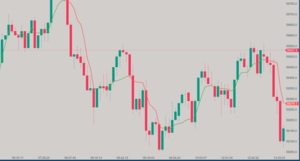
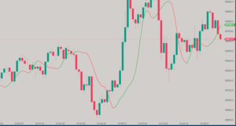

## [Disclaimer](disclaimer.md)
The indicators and tools provided on this website are designed for educational and informational purposes only and are not intended as financial advice. Trading in financial markets, including cryptocurrencies, carries a high level of risk and may not be suitable for all investors. The high volatility of cryptocurrencies can result in significant gains as well as losses. You should carefully consider your investment objectives, level of experience, and risk appetite before engaging in any trading activity.

# Welcome to My Atas.net Financial Indicators
I am not affiliated with, endorsed by, or working in partnership with the ATAS platform. I am an independent user and enthusiast who has developed these indicators based on my personal experience and extensive use of the ATAS platform.

  
  

    <h3><a href="./indicators/atr-bands">ATR Bands</a></h3>
    
The ATR Bands indicator is a powerful tool that overlays dynamic support and resistance bands on your price chart. By leveraging the Average True Range (ATR), it adapts to market volatility, providing traders with a reliable measure to identify potential breakout or reversal points. Ideal for traders looking to enhance their technical analysis toolkit with volatility-adjusted price bands.

  

  
  

    <h3><a href="./indicators/chandelier-exit">Chandelier Exit</a></h3>
    
The Chandelier Exit is a trailing stop-loss indicator designed to assist traders in managing their trades by identifying strategic exit points. Unlike static stop-loss strategies, it adapts to market volatility, providing more responsive and effective risk management. Particularly useful in trending markets, the Chandelier Exit helps capture profits while protecting against sudden reversals.

  

  
  

    <h3><a href="./indicators/candle-duration">Candle Duration</a></h3>
    
The Candle Duration indicator reintroduces the time dimension into non-time-based charts on the ATAS platform, such as volume, delta, or tick charts. It color-codes candles based on the time they take to form, offering insights into market activity.

  

  
  

    <h3><a href="./indicators/vidya">Variable Index Dynamic Average (VIDYA)</a></h3>
    
The VIDYA indicator is an adaptive moving average that dynamically adjusts to market volatility using the Chande Momentum Oscillator. It helps traders identify trend direction with customizable colors for bullish and bearish signals, providing a more responsive and visually intuitive analysis tool.

  

  
  

    <h3><a href="./indicators/alma">Arnaud Legoux Moving Average (ALMA)</a></h3>
    
The ALMA is a smooth, adaptive moving average that minimizes lag and noise, making it ideal for trend identification. It features adjustable parameters and optional directional coloring for easy visualization of market trends.

  

