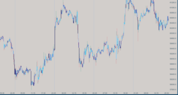

## [Disclaimer](disclaimer.md)
The indicators and tools provided on this website are designed for educational and informational purposes only and are not intended as financial advice. Trading in financial markets, including cryptocurrencies, carries a high level of risk and may not be suitable for all investors. The high volatility of cryptocurrencies can result in significant gains as well as losses. You should carefully consider your investment objectives, level of experience, and risk appetite before engaging in any trading activity.

# Welcome to My Atas.net Financial Indicators
I am not affiliated with, endorsed by, or working in partnership with the ATAS platform. I am an independent user and enthusiast who has developed these indicators for my personal use, based on my own experience and extensive use of the ATAS platform. I will be publishing new indicators regularly, so if you're interested in staying updated, follow me on Twitter and Instagram.

  
  

    <h3><a href="./indicators/candle-delta-gradient">Candle Delta Gradient</a></h3>
    
The Candle Delta Gradient indicator visualizes the net difference between buying and selling volumes (delta) through color gradients on your chart. I like using this indicator on cumulative trades charts to gain a different perspective on the tape. It provides a clear view of market sentiment and helps identify shifts in trading activity.

  

  
  

    <h3><a href="./indicators/atr-bands">ATR Bands</a></h3>
    
The ATR Bands indicator overlays dynamic support and resistance bands on your price chart by leveraging the Average True Range (ATR). I like to use this indicator on cumulative trade charts where it’s not always easy to see the trend. The bands adapt to market volatility, providing a reliable measure for identifying potential breakout or reversal points.

  

  
  

    <h3><a href="./indicators/chandelier-exit">Chandelier Exit</a></h3>
    
The Chandelier Exit is a trailing stop-loss indicator that I often use in combination with another indicator as a primary or confirmation tool. It adapts to market volatility, helping to capture profits while protecting against sudden reversals. This indicator is particularly useful in trending markets for managing trades effectively.

  

  
  

    <h3><a href="./indicators/candle-duration">Candle Duration</a></h3>
    
The Candle Duration indicator reintroduces the time dimension into non-time-based charts on the ATAS platform, such as volume, delta, or tick charts. I use this indicator to spot patterns on ATAS volatility or volume charts by observing how long each candle takes to form. This approach provides deeper insights into market activity.

  

  
  

    <h3><a href="./indicators/vidya">Variable Index Dynamic Average (VIDYA)</a></h3>
    
The VIDYA indicator is an adaptive moving average that adjusts dynamically to market volatility using the Chande Momentum Oscillator. I often use VIDYA as a baseline in my strategies, combining it with other indicators to identify trend direction. It offers a more responsive and visually intuitive analysis tool with customizable colors for bullish and bearish signals.

  

  
  

    <h3><a href="./indicators/alma">Arnaud Legoux Moving Average (ALMA)</a></h3>
    
The ALMA is a smooth, adaptive moving average that minimizes lag and noise, making it ideal for trend identification. I frequently use ALMA in my strategies as a baseline indicator, often pairing it with others to enhance accuracy. It features adjustable parameters and optional directional coloring for easy visualization of market trends.

  

