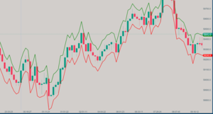

## [Disclaimer](disclaimer.md)
The indicators and tools provided on this website are designed for educational and informational purposes only and are not intended as financial advice. Trading in financial markets, including cryptocurrencies, carries a high level of risk and may not be suitable for all investors. The high volatility of cryptocurrencies can result in significant gains as well as losses. You should carefully consider your investment objectives, level of experience, and risk appetite before engaging in any trading activity.

# Welcome to My Atas.net Financial Indicators
I am not affiliated with, endorsed by, or working in partnership with the ATAS platform. I am an independent user and enthusiast who has developed these indicators based on my personal experience and extensive use of the ATAS platform.

## Indicators

### [ATR Bands](./indicators/atr-bands.md)
{: width="300" height="169"}

ATR Bands use the Average True Range to create dynamic support and resistance levels, adapting to market volatility for more precise trading signals.

### [Chandelier Exit](./indicators/chandelier-exit.md)
{: width="300" height="169"}

Chandelier Exit is a trailing stop-loss indicator that adapts to market volatility, helping traders protect profits and manage risk effectively.

### [Candle Duration](./indicators/candle-duration.md)
{: width="300" height="169"}

Candle Duration visualizes the time span of each candle, helping traders identify areas of high and low market activity.

### [Variable Index Dynamic Average (VIDYA)](./indicators/vidya.md)
{: width="300" height="169"}

VIDYA is an adaptive moving average that adjusts its sensitivity based on market volatility, providing more responsive signals in volatile markets.

### [Arnaud Legoux Moving Average (ALMA)](./indicators/alma.md)
{: width="300" height="169"}

ALMA is a sophisticated moving average that reduces lag while maintaining smoothness, ideal for trend identification and noise reduction in financial data.

