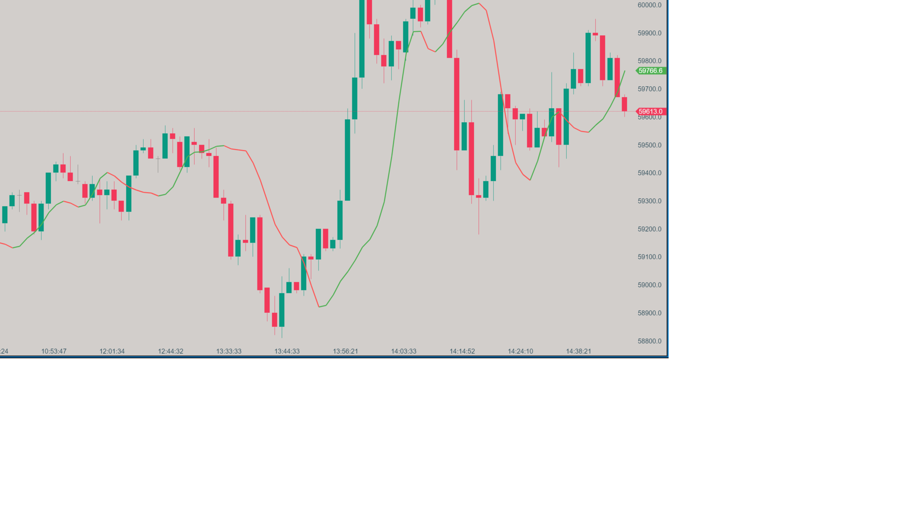

# Arnaud Legoux Moving Average (ALMA)

## Description

The Arnaud Legoux Moving Average (ALMA) is an advanced moving average indicator designed to minimize lag while maintaining smoothness. By applying a Gaussian distribution to weight the moving average, ALMA provides a more responsive and accurate representation of price trends. This balance between noise reduction and responsiveness makes ALMA particularly effective for traders looking to identify trends with greater precision.

## Key Features

- **Reduced Lag**: Offers less lag compared to traditional moving averages, making it more responsive to recent price changes.
- **Customizable Parameters**: Fine-tune the indicator with adjustable period, sigma, and offset to suit various market conditions.
- **Colored Direction Option**: Visualize trend direction easily with customizable bullish and bearish colors.
- **Noise Reduction**: Balances the need for smoothness with the ability to respond to market changes, minimizing false signals.

## How it Works

ALMA calculates a weighted moving average using a Gaussian distribution centered around a user-defined offset. The three main parameters—Period, Sigma, and Offset—allow traders to control the balance between responsiveness and smoothness:

1. **Period**: The number of bars used in the calculation, influencing the responsiveness of the moving average.
2. **Sigma**: Controls the shape of the Gaussian distribution, affecting the smoothness of the moving average.
3. **Offset**: Determines the center of the Gaussian curve, influencing the overall lag of the moving average.

By giving more weight to recent prices while still considering older data, ALMA achieves a smoother, more responsive moving average that is well-suited to various trading strategies.

## How to Use

1. **Trend Identification**: When the price is above the ALMA line, it suggests an uptrend; when below, it suggests a downtrend.
2. **Support and Resistance**: The ALMA line can act as dynamic support during uptrends and resistance during downtrends.
3. **Crossovers**: Use price or faster moving average crossovers with ALMA to signal potential trend changes.
4. **Trend Strength**: The angle and direction of the ALMA line can indicate the strength and momentum of a trend.

## Parameters

- **Period**: Default is 9, with a range from 1 to 10,000. Defines the number of bars used in the calculation.
- **Sigma**: Default is 6, with a range from 0.1 to 10. Controls the smoothness by adjusting the Gaussian distribution.
- **Offset**: Default is 0.85, with a range from 0.0 to 1.0. Sets the center of the weights distribution, influencing lag.
- **Colored Direction**: Option to color the ALMA line based on its slope, making it easier to visualize trend direction.
- **Bullish Color**: Color for an upward slope (default: Green).
- **Bearish Color**: Color for a downward slope (default: Red).

## Download

[Download ALMA Indicator](https://github.com/Zorba-the-buddhah/Zorba-The-Buddhah.github.io/releases/download/v1.0.0/Arnaud.Legoux.Moving.Average.zip){: .button}

## Installation Instructions

1. Download the ALMA indicator file (.dll).
2. Place the .dll file into the `Documents/ATAS/Indicators` folder on your computer.
3. After adding the file, a blue button will appear on the bottom right panel of the ATAS platform, indicating that the list of indicators has been updated.
4. Click the blue button to refresh the indicator list.
5. The ALMA indicator will now appear in the list of indicators under the "Zorba the Buddhah" section.

For any issues or questions related to the indicator, please [contact me](mailto:zorba.the.buddhah@gmail.com).
