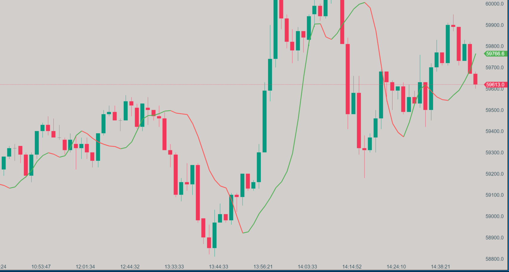

# Arnaud Legoux Moving Average (ALMA)

{: width="800" height="450"}

## Description

The Arnaud Legoux Moving Average (ALMA) is an advanced moving average indicator designed to reduce lag while maintaining smoothness. It uses a Gaussian distribution to weight the moving average, providing a more responsive and accurate representation of price trends.

## Key Features

- Reduced lag compared to traditional moving averages
- Customizable parameters for fine-tuning
- Colored direction option for easy trend identification
- Balances noise reduction and responsiveness

## How it Works

ALMA calculates a weighted moving average using a Gaussian distribution. The indicator has three main parameters:

1. Period: The number of bars used in the calculation
2. Sigma: Controls the shape of the Gaussian distribution
3. Offset: Determines the overall lag of the moving average

The Gaussian distribution allows ALMA to give more weight to recent prices while still considering older data, resulting in a smoother, more responsive moving average.

## How to Use

1. Trend Identification: When the price is above the ALMA line, it suggests an uptrend. When below, it suggests a downtrend.
2. Support and Resistance: The ALMA line can act as dynamic support in uptrends and resistance in downtrends.
3. Crossovers: Price or faster moving average crossovers with ALMA can signal potential trend changes.
4. Trend Strength: The angle and direction of the ALMA line can indicate trend strength.

## Parameters

- Period: Default is 9, range is 1-10000
- Sigma: Default is 6, range is 0.1-10
- Offset: Default is 0.85, range is 0.0-1.0
- Colored Direction: Option to color the line based on its slope
- Bullish Color: Color for upward slope (default: Green)
- Bearish Color: Color for downward slope (default: Red)

## Download

[Download ALMA Indicator](../downloads/alma.dll){: .button}

## Installation Instructions

1. Download the ALMA indicator file (.dll)
2. Place the .dll file into the `Documents/ATAS/Indicators` folder on your computer.
3. After adding the file, a blue button will appear on the bottom right panel of the ATAS platform, indicating that the list of indicators has been updated.
4. Click the blue button to refresh the indicator list.
5. The ALMA indicator will now appear in the list of indicators under the "Zorba the Buddhah" section.

To report bugs, comment, or for any questions, please [contact us](mailto:zorba.the.buddhah@gmail.com).
