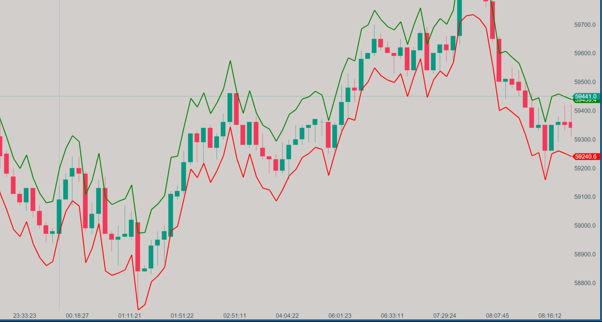

# ATR Bands

## Description

ATR Bands is a powerful tool that leverages the Average True Range (ATR) to create dynamic support and resistance levels. These bands adjust to market volatility, offering traders more precise trading signals and aiding in the identification of potential breakouts or reversals. By expanding during volatile periods and contracting during calmer markets, the ATR Bands provide a reliable framework for analyzing price movements.

## Key Features

- **Dynamic Support and Resistance**: Automatically adjusts levels based on market volatility.
- **Volatility-Adjusted**: Uses ATR to account for changing market conditions.
- **Customizable Parameters**: Easily adjust the period and multiplier to suit your trading style.
- **Clear Visual Representation**: Displays upper and lower bands that clearly outline market boundaries.

## How it Works

The ATR Bands indicator calculates two bands around the current price:

1. **Upper Band**: Calculated as `Current Price + (ATR * Multiplier)`.
2. **Lower Band**: Calculated as `Current Price - (ATR * Multiplier)`.

The ATR is computed using a specified period, which determines the lookback window for assessing volatility. The bands' distance from the price is controlled by the multiplier, allowing them to dynamically reflect market conditions.

## How to Use

1. **Support and Resistance**: Use the upper and lower bands as dynamic support and resistance levels.
2. **Breakout Trading**: A break above the upper band or below the lower band can indicate a potential breakout.
3. **Mean Reversion**: When the price touches or exceeds the bands, it may signal a potential reversal back toward the mean.
4. **Volatility Analysis**: The width between the bands visually represents market volatility, helping you gauge the strength of market moves.

## Parameters

- **Period**: Default is 14. Defines the number of bars used to calculate the ATR.
- **Multiplier**: Default is 1.0. Adjusts the distance of the bands from the price, scaling the impact of ATR on the band placement.

## Strengths

- **Versatile Application**: Suitable for various timeframes and asset classes, whether you are a day trader, swing trader, or long-term investor.
- **Enhanced Signal Accuracy**: The dynamic nature of the ATR Bands reduces the risk of false signals in volatile markets.
- **Complementary Tool**: Works well with other indicators such as moving averages or oscillators to confirm trading signals.

## Download

[Download ATR Bands Indicator](../downloads/atr-bands.dll){: .button}

## Installation Instructions

1. Download the ATR Bands indicator file (.dll).
2. Place the .dll file into the `Documents/ATAS/Indicators` folder on your computer.
3. After adding the file, a blue button will appear on the bottom right panel of the ATAS platform, indicating that the list of indicators has been updated.
4. Click the blue button to refresh the indicator list.
5. The ATR Bands indicator will now appear in the list of indicators under the "Zorba the Buddhah" section.

For any issues or questions related to the indicator, please [contact me](mailto:zorba.the.buddhah@gmail.com).
