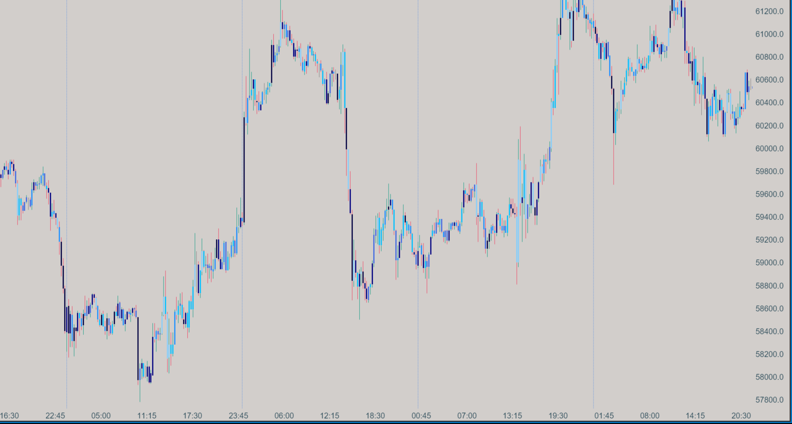

# Candle Delta Gradient

## Description

The **Candle Delta Gradient** indicator visualizes the net difference between buying and selling volumes, known as delta, directly on your chart through color gradients. This indicator provides insights into market sentiment and trading activity by coloring each candle based on its delta value.

The indicator offers two calculation modes:
- **Separated for Bullish and Bearish Candles**: Uses distinct color gradients for bullish and bearish candles.
- **Unified**: Applies a single color gradient to all candles.

These modes allow traders to select the approach that best fits their analysis needs.

## Key Features

- **Delta-Based Candle Coloring**: Each candle is colored based on its delta value, providing visual cues about buying and selling pressure.
- **Dual Calculation Modes**:
  - *Separated for Bullish and Bearish Candles*: Differentiates bullish candles with a green gradient and bearish candles with a red gradient.
  - *Unified*: Uses a blue gradient for all candles.
- **Automatic Span Calculation**: Percentile-based thresholds are calculated from historical data, adapting the indicator to various market conditions.
- **Optional Logging**: Allows users to log candle delta values for detailed analysis. This feature is disabled by default.

## How it Works

### Calculation Process:

1. **Data Collection**: The indicator gathers delta values from historical candle data.
2. **Percentile Computation**: It calculates percentiles (10th, 30th, 50th, 70th, and 90th) to establish thresholds for categorizing delta values.
3. **Color Assignment**:
   - **Separated Mode**:
     - **Bullish Candles**: Green gradient, with shades representing different levels of positive delta.
     - **Bearish Candles**: Red gradient, with shades representing different levels of negative delta.
   - **Unified Mode**: Blue gradient for all candles, representing overall market activity.

### Logging Feature:

- When enabled, the indicator logs each candle's delta value, along with whether it is bullish or bearish.

## How to Use

1. **Visualizing Market Sentiment**: Darker shades indicate stronger buying or selling pressure, while lighter shades suggest weaker pressure.
2. **Mode Selection**:
   - **Separated Mode**: Use for detailed analysis where differentiating between buying and selling pressure is important.
   - **Unified Mode**: Use for a simplified view of overall market activity.
3. **Analyzing Market Activity**: Identify periods of increased or decreased activity based on the intensity of the color gradients.

## Parameters

### Settings

- **Calculation Mode** (`Mode`):
  - **Options**: `Separated for Bullish and Bearish Candles`, `Unified`
  - **Default**: `Separated`
  - **Description**: Determines whether the indicator uses separate color gradients for bullish and bearish candles or a unified gradient for all candles.

- **Candle Delta in Logs** (`EnableLogging`):
  - **Options**: `true` or `false`
  - **Default**: `false`
  - **Description**: Enables or disables the logging of each candle's delta value.

### Color Gradients and Percentile Thresholds

The indicator calculates thresholds based on your chart’s historical data:

#### Separated Mode:

- **Bullish Candles (Green Gradient)**:
  - **10th Percentile**: Pale Green (`#98FB98`)
  - **30th Percentile**: Spring Green (`#00FF7F`)
  - **50th Percentile**: Lime Green (`#32CD32`)
  - **70th Percentile**: Forest Green (`#228B22`)
  - **90th Percentile**: Dark Green (`#006400`)
  - **Above 90th Percentile**: Darkest Green (`#004000`)

- **Bearish Candles (Red Gradient)**:
  - **10th Percentile**: Light Salmon (`#FFA07A`)
  - **30th Percentile**: Tomato (`#FF6347`)
  - **50th Percentile**: Crimson (`#DC143C`)
  - **70th Percentile**: Fire Brick (`#B22222`)
  - **90th Percentile**: Dark Red (`#8B0000`)
  - **Above 90th Percentile**: Darkest Red (`#660000`)

#### Unified Mode:

- **All Candles (Blue Gradient)**:
  - **10th Percentile**: Light Sky Blue (`#87CEFA`)
  - **30th Percentile**: Deep Sky Blue (`#00BFFF`)
  - **50th Percentile**: Dodger Blue (`#1E90FF`)
  - **70th Percentile**: Royal Blue (`#4169E1`)
  - **90th Percentile**: Navy (`#000080`)
  - **Above 90th Percentile**: Darkest Blue (`#000040`)

## Download

[Download Candle Delta Gradient Indicator](https://github.com/Zorba-the-buddhah/Zorba-The-Buddhah.github.io/releases/download/v1.0.0/Candle.Delta.Gradient.zip){: .button}

## Installation Instructions

1. Download the Candle Delta Gradient indicator file (.dll).
2. Place the .dll file into the `Documents/ATAS/Indicators` folder on your computer.
3. After adding the file, a blue button will appear on the bottom right panel of the ATAS platform, indicating that the list of indicators has been updated.
4. Click the blue button to refresh the indicator list.
5. The Candle Delta Gradient indicator will now appear in the list of indicators under the "Zorba the Buddhah" section.

For any issues or questions related to the indicator, please [contact me](mailto:zorba.the.buddhah@gmail.com).
