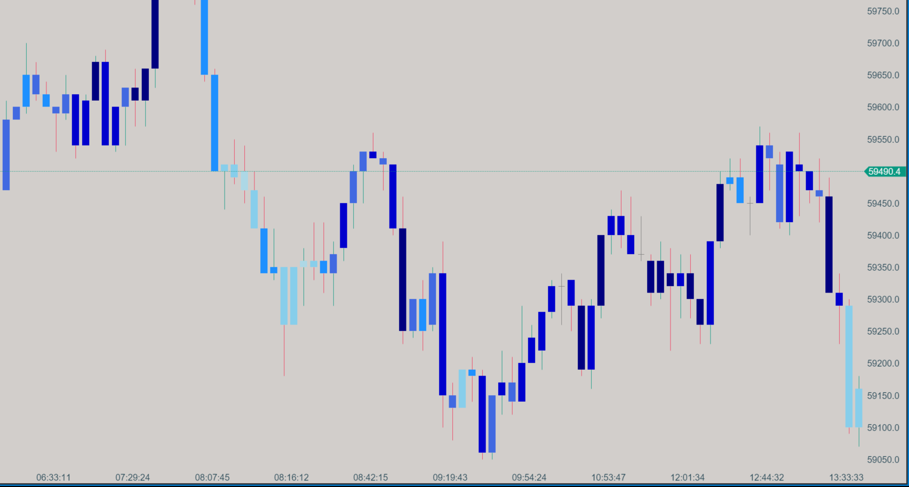

# Candle Duration

{: width="800" height="450"}

## Description

The Candle Duration indicator visualizes the time span of each candle on your chart. This unique indicator helps traders identify areas of high and low market activity by coloring candles based on their duration.

## Key Features

- Automatically calculates and adjusts to market rhythms
- Uses a color gradient to represent different duration spans
- Helps identify periods of high and low market activity
- Adapts to different timeframes automatically

## How it Works

The Candle Duration indicator calculates the time difference between each candle and assigns a color based on its duration. The indicator uses six different color shades, ranging from light blue for the shortest durations to navy for the longest durations.

The duration spans are calculated automatically based on the historical data of your chart, ensuring that the indicator adapts to different timeframes and market conditions.

## How to Use

1. Market Activity Analysis: Identify periods of high activity (shorter durations, lighter colors) and low activity (longer durations, darker colors).
2. Session Transitions: Recognize transitions between different trading sessions or market opens/closes.
3. Volatility Insights: Clusters of short-duration candles might indicate increased volatility or significant market events.
4. Trade Setup Identification: Use in conjunction with other indicators to confirm trade setups during periods of desired market activity.

## Parameters

The Candle Duration indicator automatically calculates its parameters based on the historical data of your chart. It uses percentiles to determine the color thresholds:

- 10th percentile: Light Blue
- 30th percentile: Sky Blue
- 50th percentile: Dodger Blue
- 70th percentile: Royal Blue
- 90th percentile: Medium Blue
- Above 90th percentile: Navy

## Download

[Download Candle Duration Indicator](../downloads/candle-duration-indicator.dll){: .button}

## Installation Instructions

1. Download the Candle Duration indicator file (.dll)
2. Place the .dll file into the `Documents/ATAS/Indicators` folder on your computer.
3. After adding the file, a blue button will appear on the bottom right panel of the ATAS platform, indicating that the list of indicators has been updated.
4. Click the blue button to refresh the indicator list.
5. The Candle Duration indicator will now appear in the list of indicators under the "Zorba the Buddhah" section.

To report bugs, comment, or for any questions, please [contact us](mailto:zorba.the.buddhah@gmail.com).
