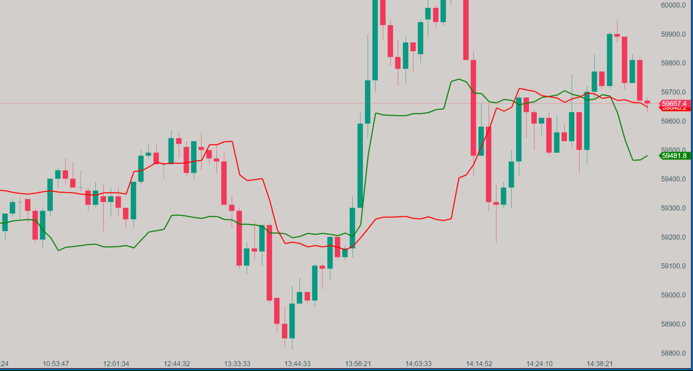

# Chandelier Exit

{: width="800" height="450"}

## Description

The Chandelier Exit is a volatility-based indicator designed to set a trailing stop-loss that adapts to market conditions. It helps traders protect profits and manage risk by providing dynamic exit points that adjust based on market volatility.

## Key Features

- Volatility-based trailing stop-loss
- Separate long and short exit levels
- Uses Average True Range (ATR) for volatility measurement
- Customizable parameters for fine-tuning

## How it Works

The Chandelier Exit calculates two lines:

1. Long Stop: Highest high over the specified period minus (ATR * multiplier)
2. Short Stop: Lowest low over the specified period plus (ATR * multiplier)

The indicator uses the Average True Range (ATR) to measure volatility and adjust the stop levels accordingly. This allows the stop-loss to be more responsive in volatile markets and less likely to be triggered by normal market noise.

## How to Use

1. Long Trades: Enter when the price is above the Long Stop line. Exit when the price closes below the Long Stop.
2. Short Trades: Enter when the price is below the Short Stop line. Exit when the price closes above the Short Stop.
3. Trend Following: Use the Long Stop for uptrends and the Short Stop for downtrends to trail your stop-loss.
4. Breakout Confirmation: Use in conjunction with other indicators to confirm breakouts and manage positions.

## Parameters

- ATR Period: Default is 22, determines the lookback period for calculating ATR
- ATR Multiplier: Default is 3.0, adjusts the distance of the stop from the price
- Use Close Price: Option to use closing prices instead of high/low for calculations

## Download

[Download Chandelier Exit Indicator](../downloads/chandelier-exit.dll){: .button}

## Installation Instructions

1. Download the Chandelier Exit indicator file (.dll)
2. Place the .dll file into the `Documents/ATAS/Indicators` folder on your computer.
3. After adding the file, a blue button will appear on the bottom right panel of the ATAS platform, indicating that the list of indicators has been updated.
4. Click the blue button to refresh the indicator list.
5. The Chandelier Exit indicator will now appear in the list of indicators under the "Zorba the Buddhah" section.

To report bugs, comment, or for any questions, please [contact us](mailto:zorba.the.buddhah@gmail.com).
