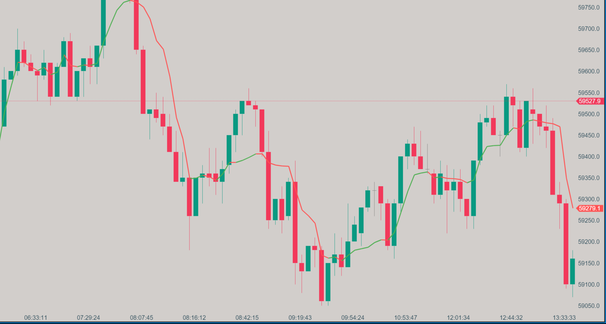

# Variable Index Dynamic Average (VIDYA)

## Description

The Variable Index Dynamic Average (VIDYA) is an adaptive moving average designed to adjust its sensitivity based on market volatility. By combining an Exponential Moving Average (EMA) with the Chande Momentum Oscillator (CMO), VIDYA becomes more responsive in volatile markets and smoother in stable markets. This dynamic adjustment provides a more accurate representation of the current trend, making it a powerful tool for identifying market direction.

## Key Features

- **Adaptive to Market Volatility**: Adjusts its responsiveness based on market conditions.
- **Combination of EMA and CMO**: Leverages the strengths of both indicators for dynamic trend analysis.
- **Responsive in Volatile Markets**: Reacts quickly to price changes when volatility is high.
- **Smoother in Stable Markets**: Reduces noise and remains stable during periods of low volatility.
- **Colored Direction Option**: Visually identifies bullish and bearish trends with customizable colors.

## How it Works

VIDYA uses two key components to calculate its values:

1. **Exponential Moving Average (EMA)**: Serves as the base calculation for the moving average.
2. **Chande Momentum Oscillator (CMO)**: Measures market momentum and determines the smoothing factor for the EMA.

The CMO adjusts the sensitivity of the EMA. In volatile markets, VIDYA responds more quickly to price changes, whereas in stable markets, it behaves more like a traditional moving average. The indicator also features an option to color the VIDYA line based on its direction, making trends easier to identify visually.

### Calculation Steps:

1. **EMA Calculation**: The EMA is calculated using the specified period.
2. **CMO Calculation**: The CMO calculates market momentum over a chosen period.
3. **Smoothing Factor**: The absolute value of the CMO is used as a smoothing factor to adapt the EMA.
4. **VIDYA Value**: The VIDYA is computed by applying this dynamic smoothing factor to adjust the EMA.
5. **Directional Coloring**: If enabled, the VIDYA line is colored based on whether it is trending upwards (bullish) or downwards (bearish).

## How to Use

1. **Trend Identification**: When the price is above the VIDYA line, it suggests an uptrend; when below, it suggests a downtrend.
2. **Support and Resistance**: The VIDYA line can act as dynamic support during uptrends and resistance during downtrends.
3. **Crossovers**: Price or faster moving average crossovers with VIDYA can signal potential trend changes.
4. **Volatility Analysis**: The slope and behavior of the VIDYA line provide insights into market volatility, indicating when the market is likely to be more or less reactive to price changes.

## Parameters

- **EMA Period**: Default is 14. Determines the lookback period for the Exponential Moving Average.
- **CMO Period**: Default is 14. Sets the period for the Chande Momentum Oscillator, which adjusts the EMA's sensitivity.
- **Colored Direction**: Boolean option to enable or disable the coloring of the VIDYA line based on trend direction.
- **Bullish Color**: Color used for an upward slope (default: Green).
- **Bearish Color**: Color used for a downward slope (default: Red).

## Download

[Download VIDYA Indicator](https://github.com/Zorba-the-buddhah/Zorba-The-Buddhah.github.io/releases/download/v1.0.0/VIDYA.dll){: .button}

## Installation Instructions

1. Download the VIDYA indicator file (.dll).
2. Place the .dll file into the `Documents/ATAS/Indicators` folder on your computer.
3. After adding the file, a blue button will appear on the bottom right panel of the ATAS platform, indicating that the list of indicators has been updated.
4. Click the blue button to refresh the indicator list.
5. The VIDYA indicator will now appear in the list of indicators under the "Zorba the Buddhah" section.

For any issues or questions related to the indicator, please [contact me](mailto:zorba.the.buddhah@gmail.com).
